# 19Neural_Network_Charity_Analysis

### Overview
Alphabet Soup's top Analyst, Beks; is heading up up this Charity Analysis.  Beks is responsible for analysing the data and vetting potential recipients of foundation dollars to ensure effective use of said dollars.  Beks has decided that the best way to do so is with a neural network program and has asked me to help her build one.  Don't "mind" if I do! 

## Deliverable One
**The ~EIN~ and ~NAME~ columns have been dropped.*

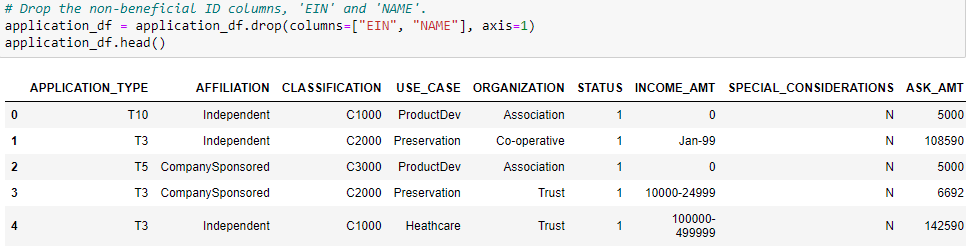    

**The columns with more than 10 unique values have been grouped together.**

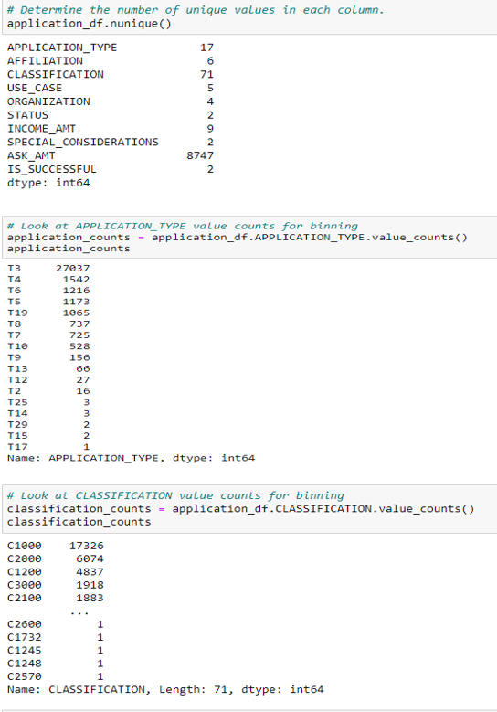   

**The categorical variables have been encoded using one-hot encoding.**

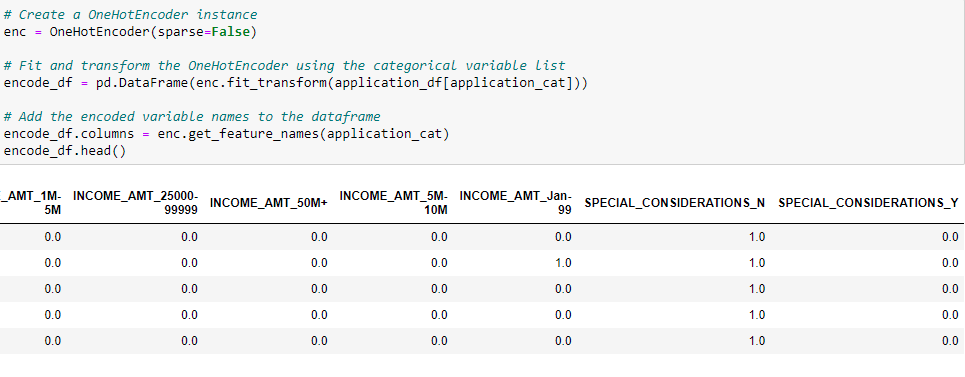  

**The preprocessed data is split into features and target arrays.**

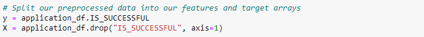 
 
**The preprocessed data is split into training and testing datasets.**

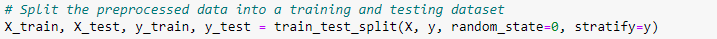
 
**The numerical values have been standardized using the ~StandardScaler()~ module.**

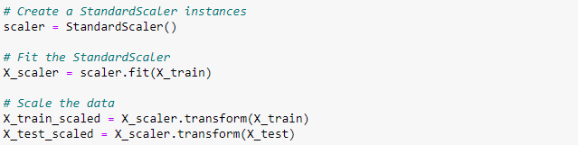  

## Deliverable Two
####The neural network model using Tensorflow Keras contains working code that performs the following steps:

**The number of layers, the number of neurons per layer, and activation function are defined. An output layer with an activation function is created. And there is an output for the structure of the model.**

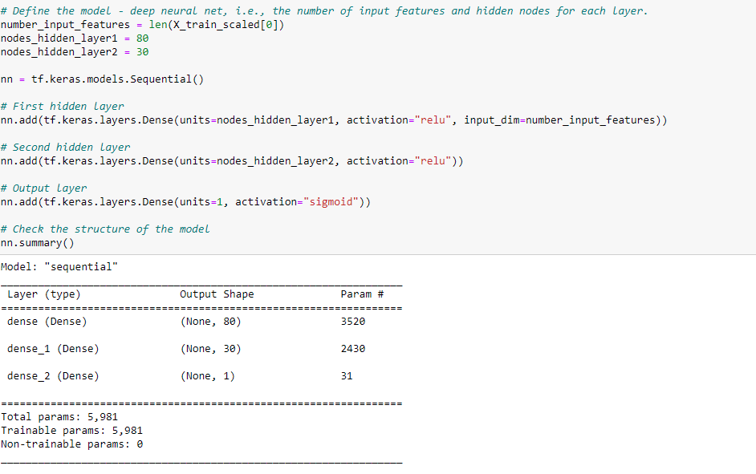    

**There is an output of the model’s loss and accuracy.**

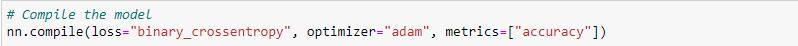  
 
**The model's weights are saved every 5 epochs.**

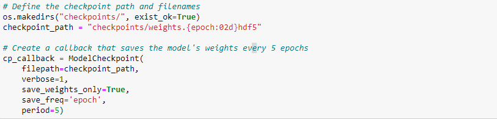

**The results are saved to an HDF5 file.**

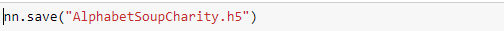

## Deliverable Three
####The model is optimized, and the predictive accuracy is increased to over 75%, or there is working code that makes three attempts to increase model performance using the following steps:
  - Noisy variables are removed from features.
  - Additional neurons are added to hidden layers.
  - Additional hidden layers are added.
  - The activation function of hidden layers or output layers is changed for optimization.

*ATTEMPT ONE* **Removed the noisy variables from features.**

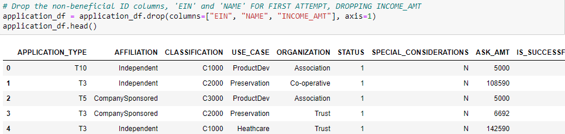    

*ATTEMPT TWO* **Additional neurons are added to hidden layers & additional hidden layers are added.**

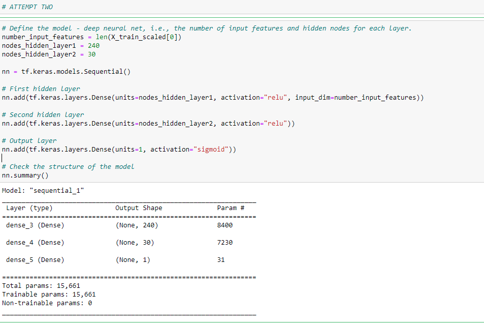  

*ATTEMPT THREE* **The activation function of hidden layers or output layers is changed for optimization.**

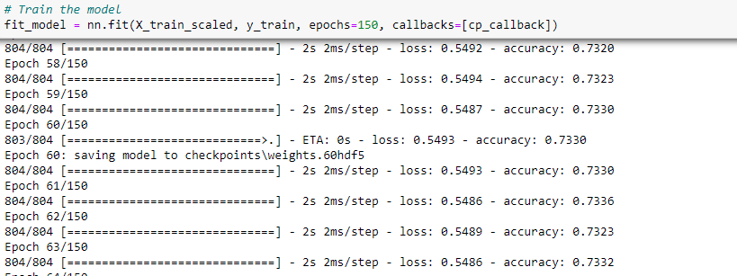

**The model's weights are saved every 5 epochs.**

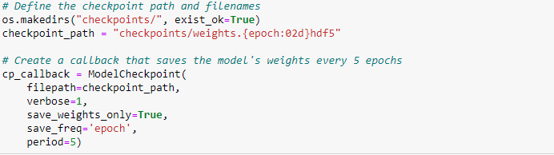

**The results are saved to an HDF5 file.**

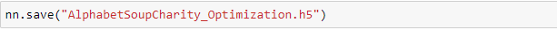

## SUMMARY
The purpose of this analysis is to see if this model that Beks and I created will work to vet potential recipients of the foundation's charity monies.  But as we couldn't get any of our tests to provide a result greater than 75%, it does not appear that our model is ready for use.
*Our accuracy scores are as follows:*
- Accuracy Scores
	- Original accuracy: 0.7303
	- Attempt #1: 0.7299
	- Attempt #2: 0.7303
	- Attempt #3: 0.7297

Our attempts to edit variables to improve performance of the model had minimal to no effect. If we would have had a larger data set, we may have been able to get this neural network formula to work more accurately.  Or, if this is the only dataset available to us, I might recommend using a Random Forest model to see if that would increase the accuracy.
	
